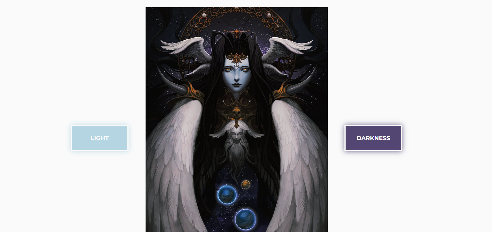
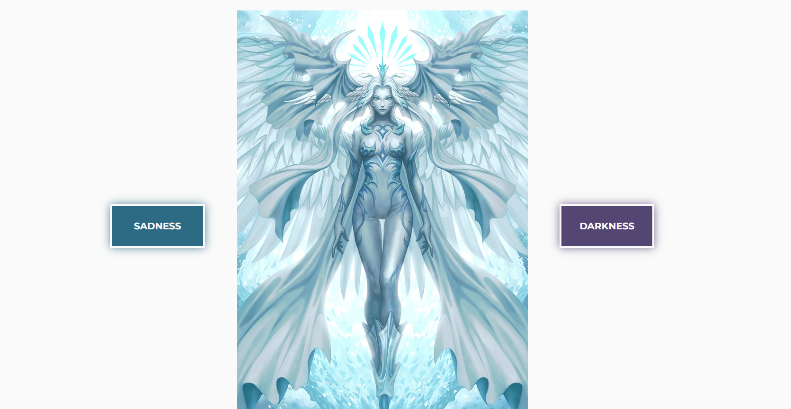
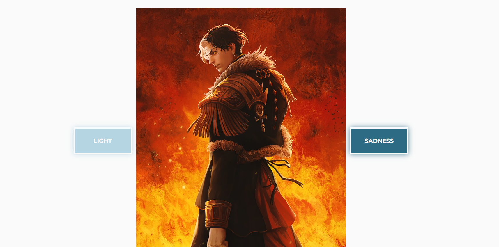

# :flower_playing_cards: Split Landing Page

Ce projet est une landing page interactive qui utilise GSAP pour gérer les animations de transition des images de fond en fonction des boutons cliqués. L'objectif est de créer une expérience fluide et visuelle en basculant entre différentes images symbolisant "Light", "Darkness" et "Sadness" avec des effets de transition.

Ce projet a été réalisé dans le cadre d'une formation sur [Udemy](https://www.udemy.com/course/50-projects-50-days/).

## Fonctionnalités

- **Transitions animées avec GSAP :** Les boutons "Light" et "Darkness" changent l'image de fond avec une animation fluide de translation et de fondu.
- **Ajout du bouton "Sadness" :** Après une première interaction, un troisième bouton "Sadness" apparaît, offrant une nouvelle ambiance visuelle.
- **Responsive Design :** Le style est adapté pour une utilisation sur différents écrans, notamment grâce aux media queries incluses dans le CSS.

### Technologies Utilisées

GSAP : Bibliothèque d'animations utilisée pour créer des transitions fluides et dynamiques

#### Structure du projet

Ce projet est le Septième d'une série dans laquelle je me donne l'objectif de perfectionner mes compétences en JavaScript.

- **index.html :** Contient la structure de base de la page avec des boutons et des images dédiées.
- **style.css :** Gère le style global de la page, y compris les effets visuels des boutons et la responsive.
- **script.js :** Inclut la logique pour gérer les animations des boutons avec GSAP.

